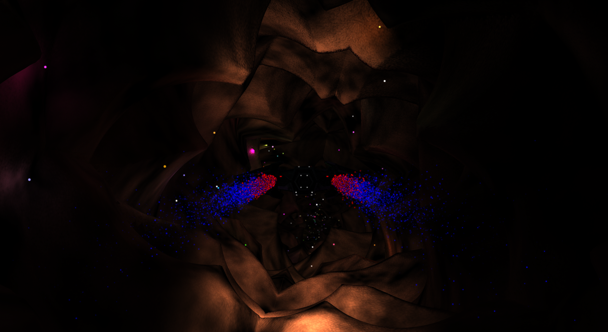

  # EscapeVulkan

### About
EscapeVulkan is an infinity runner game where the player is flying in a spaceship through a tunnel. The longer the spaceship flys without touching the wall the higher the score will be. It was developed as a project for the university and then much improved in my free time. It compiles and runs on Linux (if all dependencies are installed). You are welcome to try it on Windows and tell me 🙂

### Features
* physically based lighting utilizing [ReSTIR DI](https://research.nvidia.com/publication/2020-07_spatiotemporal-reservoir-resampling-real-time-ray-tracing-dynamic-direct) for high quality lighting (currently only the fireflies and the spaceship headlights are light source; however, using all emissive meshes is planned :)
* reinforcement learning agent (currently based on REINFORCE, which is a rather simple algorithm, so it is really hard to teach the agent anything useful)
* procedurally generated tunnel based on Bézier curves with procedural textures (precomputed as the underlying noise is quite expensive to evaluate)
* jet engine fire based on particles
* deferred rendering to prevent unnecessary ray queries

### Dependencies
#### external
* glm
* SDL2
* Vulkan
* spdlog
* Boost
* Torch
* glslc (shaderc)

#### included
* Dear ImGui
* ImPlot
* VulkanMemoryAllocator
* tinygltf

